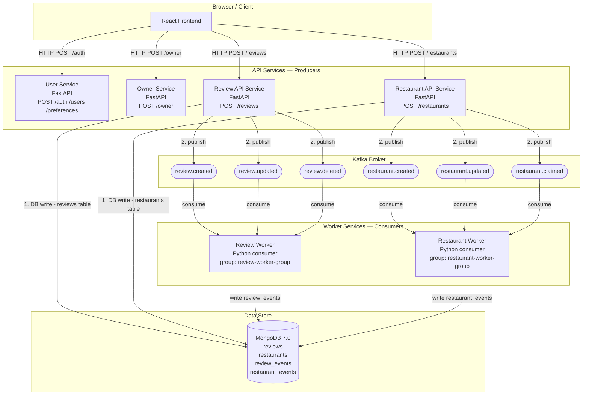

# ForkFinder — Kafka Producer/Consumer Architecture

## Mermaid Diagram (render at mermaid.live or in any Markdown viewer that supports Mermaid)



---

## ASCII Architecture Diagram

```
┌─────────────────────────────────────────────────────────────────────────────────────────┐
│                              ForkFinder — Kafka Architecture                            │
└─────────────────────────────────────────────────────────────────────────────────────────┘

  BROWSER                API SERVICES (Producers)                 KAFKA BROKER
  ─────────              ────────────────────────                 ────────────
                         ┌─────────────────────┐
  ┌────────┐  POST        │  Review API Service │──publish──►  review.created
  │        │─/reviews────►│  (FastAPI)          │──publish──►  review.updated
  │ React  │              │                     │──publish──►  review.deleted
  │Frontend│              └─────────────────────┘
  │        │
  │        │  POST        ┌─────────────────────┐
  │        │─/restaurants►│ Restaurant API Svc  │──publish──►  restaurant.created
  └────────┘              │  (FastAPI)          │──publish──►  restaurant.updated
                          │                     │──publish──►  restaurant.claimed
                          └─────────────────────┘


  KAFKA TOPICS                   WORKER SERVICES (Consumers)          DATABASE
  ────────────                   ───────────────────────────          ────────
  review.created ───consume──►  ┌───────────────────────┐            ┌────────────────┐
  review.updated ───consume──►  │    Review Worker       │──write──► │ review_events  │
  review.deleted ───consume──►  │  (Python, kafka-python)│            │   (audit log)  │
                                └───────────────────────┘            ├────────────────┤
  restaurant.created──consume►  ┌───────────────────────┐            │restaurant_events│
  restaurant.updated──consume►  │  Restaurant Worker    │──write──► │   (audit log)  │
  restaurant.claimed──consume►  │  (Python, kafka-python)│            └────────────────┘
                                └───────────────────────┘

```

---

## Flow Walkthrough — Review Submission

```
1.  User clicks "Submit Review" in the browser
    │
2.  Frontend sends  POST /reviews  { restaurant_id, rating, comment }
    │
3.  Review API Service validates the request (auth, 403 owner guard, duplicate check)
    │
4.  Review API Service writes to the  reviews  table (synchronous DB write)
    │
5.  Review API Service publishes to Kafka topic  review.created
    │   Envelope: { event_id, topic, timestamp, data: { review_id, user_id,
    │               restaurant_id, rating, comment, created_at } }
    │
6.  Review API Service returns  ReviewWithStatsResponse  to the frontend
    │   (response is immediate — Kafka publish is fire-and-forget)
    │
7.  [Async] Review Worker consumes message from  review.created
    │
8.  Review Worker writes one document to  review_events  collection
    │   Fields: event_id, event_type, review_id, restaurant_id, user_id, payload
    │
9.  Review Worker commits the Kafka offset (at-least-once delivery)
    │
10. Operator can verify the pipeline by querying:
        db.review_events.find().sort({processed_at: -1}).limit(5)
```

---

## Kafka Topics Reference

| Topic | Producer | Consumer | Payload Key Fields |
|---|---|---|---|
| `review.created` | Review API Service | Review Worker | `review_id`, `user_id`, `restaurant_id`, `rating`, `comment`, `created_at` |
| `review.updated` | Review API Service | Review Worker | `review_id`, `user_id`, `restaurant_id`, `rating`, `comment`, `updated_at` |
| `review.deleted` | Review API Service | Review Worker | `review_id`, `user_id`, `restaurant_id` |
| `restaurant.created` | Restaurant API Service | Restaurant Worker | `restaurant_id`, `name`, `created_by`, `created_at` |
| `restaurant.updated` | Restaurant API Service | Restaurant Worker | `restaurant_id`, `updated_by`, `updated_at` |
| `restaurant.claimed` | Restaurant API Service | Restaurant Worker | `restaurant_id`, `claimed_by`, `claimed_at` |
